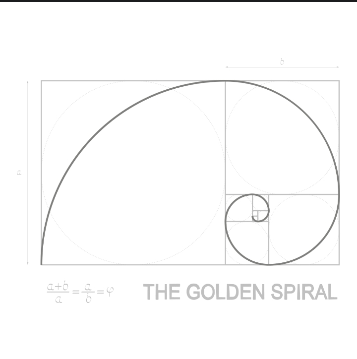
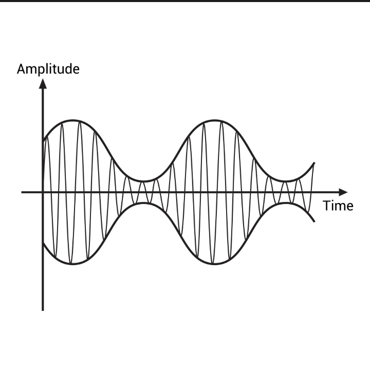

# Resonance Engine

**Therapeutic audio from pure math — not samples, not loops, not presets.**

A Python tool that generates true stereo binaural beats layered with golden ratio harmonics, living heartbeat modulation, and organic noise floors. Every run produces a unique file. Headphones required.

---

## What It Does

Generates audio from five mathematical layers:

1. **True Binaural Separation** — 432Hz to your left ear, 436Hz to your right. The 4Hz "beat" doesn't exist in the audio — it's created inside your brainstem as the corpus callosum reconciles the difference. This only works with headphones.

2. **Golden Spiral Harmonics** — Overtones stacked at irrational Phi-ratio intervals produce organic complexity no human composer would write. Each harmonic layer slowly orbits between your ears at a different speed, creating a spatial halo that never repeats.


*The Golden Ratio (Φ) — the irrational interval behind the harmonic stacking*

3. **Fibonacci HRV** — A healthy heart doesn't beat like a metronome. The amplitude pulse drifts between ~48 BPM and ~96 BPM using FM synthesis, matching real heart rate variability patterns. A soft-knee prevents the signal from ever going silent.


*Amplitude modulation envelope wrapping the carrier wave — this is what the code produces*

4. **Vascular Noise Floor** — Tunable 1/f^β noise eliminates digital silence. At 0.3% amplitude you won't hear static — you'll feel a subtle texture with the same statistical distribution found in ocean tides, neural firing, and healthy hearts. Each preset uses a different noise color: warm red for sleep, crisp blue for focus.

5. **Breath Envelope** — Cosine fade-in/fade-out so the audio emerges from and returns to silence gently. No pops, no hard edges.

Every run is unique — global phase randomization means no two generated files are identical.

## Quick Start

```bash
pip install numpy scipy sympy

python src/resonance_engine.py
```

This generates all four presets as stereo WAV files. Grab headphones, close your eyes, volume low.

## Presets

| Preset | Beat | State | Duration | Noise Color |
|--------|------|-------|----------|-------------|
| Theta | 4Hz (432/436) | Meditation, creativity | 60s | Warm pink (β=1.1) |
| Deep Sleep | 2Hz (432/434) | Sleep induction | 5min | Red (β=1.3) |
| Focus | 10Hz (432/442) | Concentration | 2min | Cool pink (β=0.95) |
| Gamma Flow | 40Hz (432/472) | Peak performance | 90s | Blue-pink (β=0.85) |

```python
from resonance_engine import generate_true_theta, generate_deep_sleep
from resonance_engine import generate_focus, generate_gamma_flow

generate_true_theta()
generate_deep_sleep()
generate_focus()
generate_gamma_flow()
```

## Custom Builds

```python
from resonance_engine import ResonanceEngine

engine = ResonanceEngine(sample_rate=44100, duration=180)  # 3 minutes

# Choose your binaural beat frequency
waves = engine.quantum_superposition_stereo(432, 438)  # 6Hz = deep theta

# Add harmonic richness (more layers = more texture)
waves = engine.golden_spiral_stack(waves, 432, layers=5)

# Render with custom parameters
engine.materialize_stereo(
    waves,
    noise_beta=1.2,          # Warm noise floor
    noise_level=0.004,       # Slightly louder
    hrv_base_rate=1.0,       # Slower heart
    hrv_drift=0.3,           # Moderate variability
    hrv_breath=0.08,         # 12.5-second breath cycle
    fade_seconds=5.0,        # Gentle fade
    filename="My_Session.wav"
)
```

### Tunable Parameters

| Parameter | What it does | Range |
|-----------|-------------|-------|
| `freq_base` | Root frequency (left ear) | 100-528Hz (432 recommended) |
| `freq_entanglement` | Right ear (difference = binaural beat Hz) | base + 1-40 |
| `layers` | Golden ratio harmonic depth | 1-6 |
| `noise_beta` | Noise color (red > 1.0 > blue) | 0.5-2.0 |
| `noise_level` | Noise floor amplitude | 0.001-0.01 |
| `hrv_base_rate` | Center heartbeat in Hz | 0.5-2.0 |
| `hrv_drift` | How much the heart rate varies | 0.1-0.6 |
| `hrv_breath` | How fast the drift oscillates | 0.05-0.2 |
| `fade_seconds` | Fade in/out duration | 1.0-10.0 |
| `duration` | Output length in seconds | Any |

### Brainwave Frequency Guide

| Beat Frequency | State | Use |
|---------------|-------|-----|
| 1-4 Hz (Delta) | Deep sleep | Sleep induction, recovery |
| 4-8 Hz (Theta) | Meditation | Creativity, deep relaxation |
| 8-13 Hz (Alpha) | Calm focus | Study, light meditation |
| 13-30 Hz (Beta) | Alertness | Active thinking, energy |
| 30-100 Hz (Gamma) | Peak state | Insight, cross-cortical binding |

## How It Works

The engine builds audio symbolically using SymPy, then collapses to NumPy for rendering — the waveform is defined as pure mathematics before it ever becomes sound.

The pink noise is generated via spectral filtering: white noise is transformed to frequency domain, scaled by `1/f^(β/2)`, and transformed back. β=1 gives classic pink noise; higher values push energy toward bass (warmer), lower values push toward treble (crisper).

Phase randomization ensures every run starts each oscillator, harmonic, and panning orbit at a unique position in its cycle. Two files generated from the same preset will have the same mathematical structure but different phase relationships — like two performances of the same composition.

## Requirements

- Python 3.8+
- numpy
- scipy
- sympy

## Credits

Designed by **Samuel Jackson Grim** (The Architect) through multi-agent AI collaboration.

- **Gemini** — Research orchestration, stereo architecture, orbital panning
- **Copilot** — Implementation support
- **Grok** — Phase randomization, HRV soft-knee, β noise palette, final review
- **Claude** — Code consolidation, documentation, packaging

## License

MIT. Use it however you want. Make something that helps someone.
